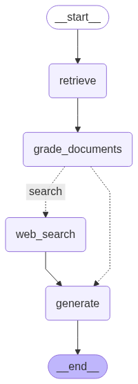
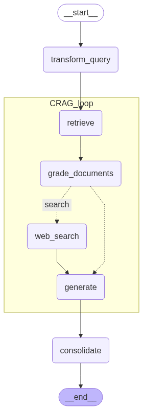

# EcoLens

**IBM Call for Code 2025 Submission**

🔗 [Live Demo](https://climate-change-silk.vercel.app)

---

## 📌 Overview

**EcoLens** is an AI-powered web application that helps users understand the environmental impact of their consumption habits — starting with something as simple as a chocolate bar.

Whether it’s carbon emissions, water usage, recyclability, or ethical sourcing, **EcoLens** zooms in on the lifecycle of products and services, giving users personalized and location-aware insights to make more sustainable choices.

---

## Features

-  **AI-Driven Product Impact Analysis**  
  Understand the carbon, water, and ethical footprint of your queries in seconds.

-  **Location-Aware Insights**  
  Use your latitude and longitude to tailor responses to your region or country.

-  **Agentic RAG Pipeline**  
  Multi-step retrieval-augmented generation using LangGraph.

-  **Trusted Sources**  
  Pulls from OpenLCA, Ecoinvent, IPCC, UNEP, and other climate databases.

-  **Structured Output**  
  Easily digestible JSON-based summaries with citations and actionable recommendations.

---

##  Tech Stack

| Layer        | Tools Used                                      |
|--------------|--------------------------------------------------|
| Frontend     | Next.js, Tailwind CSS, React                    |
| Backend      | LangGraph, IBM Watsonx.ai, Next.js api route             |
| AI Models    | meta-llama/llama-3-405b-instruct                |
| Retrieval    | FAISS, Tavily Web Search                        |
| Data Sources | Ecoinvent, OpenLCA, IPCC, OpenFoodFacts, UNEP   |
| Deployment   | Vercel                                          |

---

##  Architecture

EcoLens uses a **Hierarchical Agentic RAG System**:

1. **Query Decomposition**  
   Complex user prompts are broken down into sub-questions.

2. **CRAG Loop**  
   Each sub-question invokes a retrieval-grade-generate pipeline.

3. **Conditional Web Search**  
   Web search is only triggered if retrieved documents are insufficient.

4. **Consolidation**  
   All sub-answers are merged using a JSON-constrained final generation step.

5. **Location Integration**  
   Optional lat/long values personalize responses for regional relevance.

   ##  Diagrams

   ### CRAG Pipeline

   

   ### Nested CRAG Example

   

# Pipeline for Streaming Logs and Responses in EcoLens (climate-change)

> **Note:**  
> Search result responses are limited to 10 results. This explanation is based on the most relevant files found. For more, [view code search results on GitHub](https://github.com/BHK4321/climate-change/search?q=stream+pipeline+log+response).

---

## 🗺️ Overview

EcoLens uses a **multi-layered architecture** for streaming logs and AI-generated responses to the frontend in real time. This pipeline involves:

- A **Next.js frontend** (React) that displays streamed logs and results to users.
- An **API route** (`pages/api/query.js`) acting as a proxy and streaming handler.
- A **FastAPI backend** (`script/base_rag_api.py`) that runs the agentic RAG pipeline and streams output.
- A **Python RAG pipeline** (`script/base_rag.py`) that executes the actual retrieval-augmented generation logic.

The system leverages **Server-Sent Events (SSE)** and custom chunked streaming to provide responsive, real-time feedback to users.

---

## 🔄 Step-by-Step Pipeline

### 1. **Frontend: Initiating the Query**

- The user submits a question (“query”) via the web UI (`app/home/page.jsx`).
- The frontend calls the `/api/query` endpoint using a POST request, including the prompt, query type, and (optionally) latitude/longitude for location-aware results.
- The frontend uses a function like `streamWithTimeout` to handle the streaming response, parsing SSE events.

**Relevant code:**  
[`app/home/page.jsx`](https://github.com/BHK4321/climate-change/blob/main/app/home/page.jsx)

```js
await streamWithTimeout(
  '/api/query',
  { method: "POST", ... },
  async (eventType, dataStr) => {
    if (eventType === "logs") {
      // Display log lines in the UI live
    }
    if (eventType === "result") {
      // Display the final result
    }
  }
);
```

---

### 2. **API Route: Handling Streaming & Proxying**

- The Next.js API route (`pages/api/query.js`) receives the POST request.
- It forwards the request to the FastAPI backend (`/ask` endpoint) with all relevant data.
- It sets the response headers for **SSE**:
  ```
  Content-Type: text/event-stream
  Cache-Control: no-cache
  Connection: keep-alive
  ```
- It reads the backend’s streamed response chunk-by-chunk, handling:
  - **Logs:** Lines before a separator (`===RESULT===`)
  - **Result:** JSON output after the separator
- The handler emits SSE events:
  - `event: logs` for each log line
  - `event: result` for the final answer
  - `event: heartbeat` every 5 seconds to keep the connection alive

**Relevant code:**  
[`pages/api/query.js`](https://github.com/BHK4321/climate-change/blob/main/pages/api/query.js)

```js
res.writeHead(200, { "Content-Type": "text/event-stream", ... });
...
while (true) {
  const { value, done } = await reader.read();
  if (value) {
    const chunk = decoder.decode(value, { stream: !done });
    // Parse for logs or final result using separator
    res.write(`event: logs\ndata: ${JSON.stringify(line)}\n\n`);
  }
  if (done) {
    res.write(`event: result\ndata: ${JSON.stringify(result)}\n\n`);
    res.end();
    break;
  }
}
```

---

### 3. **Backend: FastAPI Streaming Response**

- The FastAPI endpoint (`/ask` in `script/base_rag_api.py`) authenticates and parses the request.
- It launches a subprocess that runs the core RAG pipeline script (`base_rag.py`), streaming its stdout line by line.
- The FastAPI endpoint returns a `StreamingResponse` with each line as it is produced.

**Relevant code:**  
[`script/base_rag_api.py`](https://github.com/BHK4321/climate-change/blob/main/script/base_rag_api.py)

```python
def generate():
    process = subprocess.Popen([...], stdout=subprocess.PIPE, ...)
    for line in iter(process.stdout.readline, ''):
        yield line
return StreamingResponse(generate(), media_type="text/plain")
```

---

### 4. **Python RAG Pipeline: Log and Result Streaming**

- `base_rag.py` implements the agentic RAG (retrieval-augmented generation) logic.
- As the pipeline runs, it prints log lines to stdout.
- After finishing, it prints a separator line (`===RESULT===`), then outputs the final result as a JSON string.
- This output is streamed back up the chain.

**Relevant code:**  
[`script/base_rag.py`](https://github.com/BHK4321/climate-change/blob/main/script/base_rag.py)

```python
print("...log line...", flush=True)
...
print("===RESULT===")
print(json.dumps({"result": response}), flush=True)
```

---


## 📦 **Summary Table**

| Layer           | Technology / File                       | Purpose                                                        |
|-----------------|-----------------------------------------|----------------------------------------------------------------|
| **Frontend**    | `app/home/page.jsx`                     | User input, receives SSE logs/results, live feedback           |
| **API Route**   | `pages/api/query.js`                    | Proxies request, parses/streams logs & result as SSE to client |
| **Backend API** | `script/base_rag_api.py`                | Authenticates, starts RAG process, streams output              |
| **RAG Logic**   | `script/base_rag.py`                    | Runs pipeline, prints logs/results, defines separator          |

---

## ⚡ **Key Streaming Details**

- **Logs** and **final results** are separated by the string `===RESULT===` in the backend output.
- Frontend parses SSE events: `logs`, `result`, and `heartbeat`.
- Heartbeats prevent timeouts in serverless environments.
- All streaming is **line-by-line** for logs and **JSON chunk** for results.

---

## 📚 References

- [pages/api/query.js](https://github.com/BHK4321/climate-change/blob/main/pages/api/query.js)
- [script/base_rag_api.py](https://github.com/BHK4321/climate-change/blob/main/script/base_rag_api.py)
- [script/base_rag.py](https://github.com/BHK4321/climate-change/blob/main/script/base_rag.py)
- [app/home/page.jsx](https://github.com/BHK4321/climate-change/blob/main/app/home/page.jsx)


> **For more search results & code context, [browse the repository](https://github.com/BHK4321/climate-change/search?q=stream+pipeline+log+response).**

---

## Getting Started

### Prerequisites

- **Node.js** (v16 or higher)
- **npm** or **yarn**
- **Tavily Web Search Tool API Key**
- **IBM Watsonx.ai API Key** for enterprise-grade models

### Installation

Clone the repository and install dependencies:

```bash
git clone https://github.com/BHK4321/climate-change.git
cd climate-change
npm install
```

### Environment Variables

Create a .env.local file in the root directory and add:

```bash
TAVILY_API_KEY=your-tavily-api-key
IBM_API_KEY=your-ibm-api-key  
IBM_PROJECT_ID=your-ibm-project-id
```

### Running Locally

To start the development server:

```bash
npm run dev
```

Open your browser and go to:

```bash
http://localhost:3000
```

Refer to [script](https://github.com/BHK4321/script) folder for running the script locally with docker and start asking queries!!
or the [Live](https://climate-change-silk.vercel.app) demo is also available.
